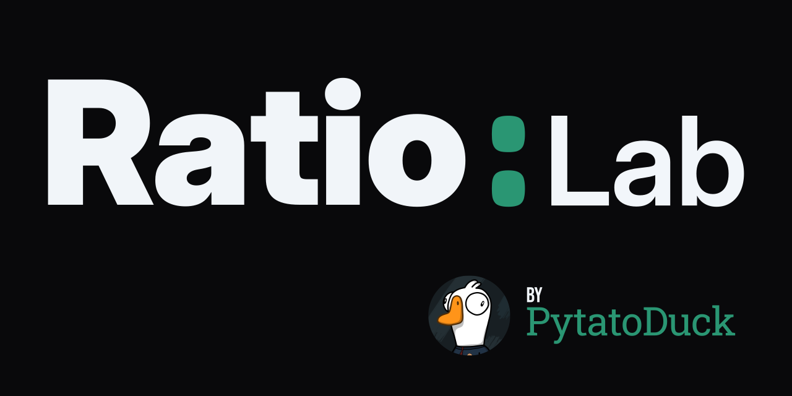

**[Ratio:Lab](https://ratio-lab.pytato.workers.dev/)** is a tool for visualizing and comparing aspect ratios and resolutions.

- **Lee Canvas**: A visualizer that automatically scales and centers all layers for comparison.
- **4v1**: Add up to 4 active overlays to compare against a Base Canvas.
- **Flip-Flop**: Orientation flipping to swap between landscape and portrait modes.
- **UI**: A fancy-ass dark mode interface built with Emerald accents, high contrast colors, and smooth Framer Motion animations.
- **Math Accuracy**: I don't math good... LLM overload says **Robust internal logic for GCD (Greatest Common Divisor) and dimension calculation, fully verified with unit tests**.

## Tech Stack

- [React 19](https://react.dev/)
- [Vite](https://vitejs.dev/)
- [Tailwind](https://tailwindcss.com/)
- [Framer Motion](https://motion.dev/)
- [Lucide React](https://lucide.dev/)

## Installation (In case I forget)

1. **Clone the repository**
   ```bash
   git clone https://github.com/PytatoDuck/ratio-lab.git
   cd ratio-lab
   ```

2. **Install dependencies**
   ```bash
   npm install
   ```

3. **Run development server**
   ```bash
   npm run dev
   ```

4. **Run math logic tests**
   ```bash
   npm run test
   ```

## How it Works

1. **Set the Base**: The top item in your layer list is the **Base Canvas**. All other overlays will be visually compared against its size.
2. **Add Overlays**: Use the "Add Overlay" button to create a comparison layer.
3. **Toggle Lock**: 
   - **Locked**: Changing the width automatically adjusts the height to maintain your Target Ratio.
   - **Unlocked**: Changing dimensions manually will update and simplify the ratio.
4. **Reorder**: Use the up/down arrows on layers to change which layer acts as the primary Base.
